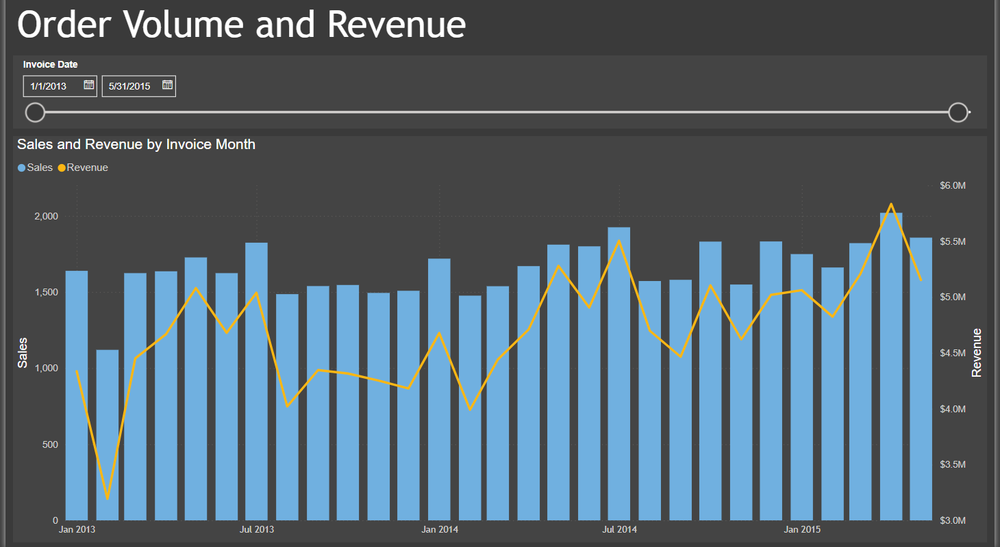
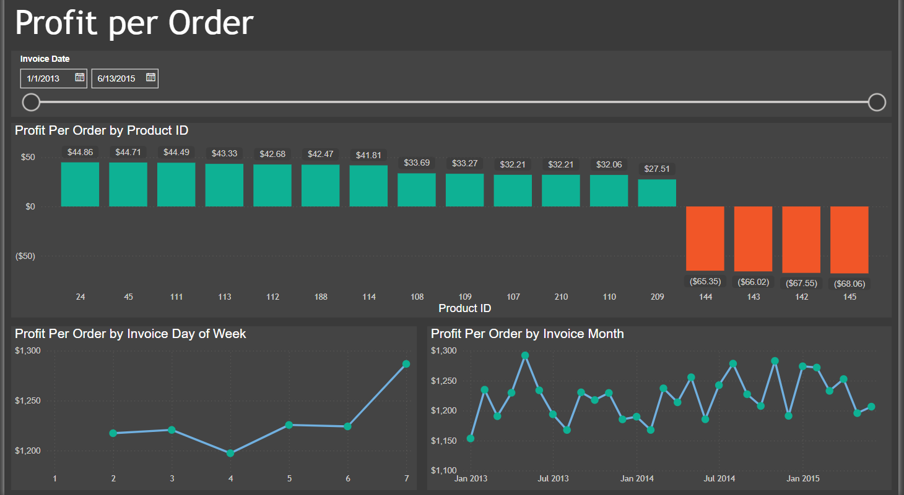

# Wide World Importers Analytics
SQL and PowerBI practice using fake company data on Wide World Importers.

## Data
This project uses sample data on a fake company, WideWorldImporters, which Microsoft provides for free and can be easily imported into a SQL Server database for personal use. 

According to the Wide World Importers documentation:

> "WideWorldImporters is a sample for SQL Server and Azure SQL Database. It showcases database design, as well as how to best leverage SQL Server features in a database. WideWorldImporters is a wholesale company. Transactions and real-time analytics are performed in the database WideWorldImporters. The database WideWorldImportersDW is an OLAP database, focused on analytics.

A backup file for this database can be downloaded [here.](https://github.com/Microsoft/sql-server-samples/releases/download/wide-world-importers-v1.0/WideWorldImporters-Full.bak)

## Dashboard
So far this dashboard contains three tabs:
  1. **Order Volume and Revenue:**
     This shows Total Sales made and Total Revenue generated with the option to drill down to the Invoice Date, Invoice Week, or Invoice Month level. A user can also adjust the time period the chart covers by using the Invoice Date slider.
     
     

  2. **Profit per Order:**
     This shows Profit per Order of each individual product for sale, the Profit per Order by Day of Week of the sale, and a time-series view of Profit per Order over time (which can be drilled down to Invoice Month, Invoice Week, or Invoice Date).
     
     

  3. **Sales-person Performace:**
     This shows the performace of each individual sales-person, looking at both revenue generated and sales made, over the user defined time period.
     
     
